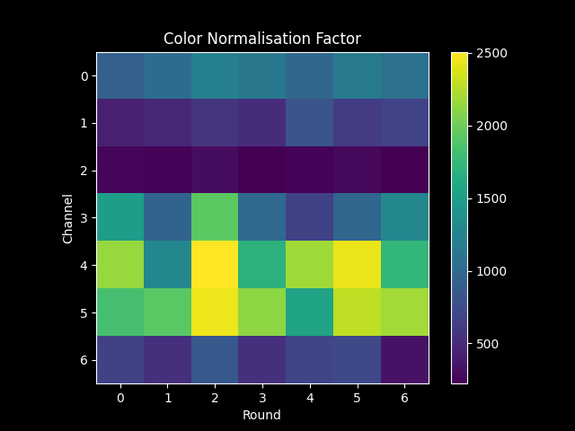
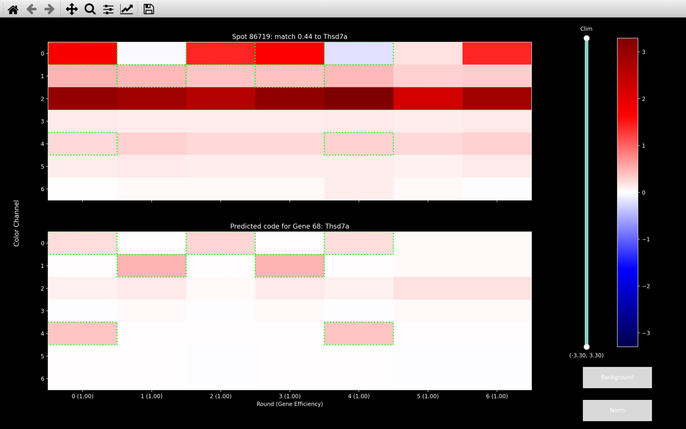
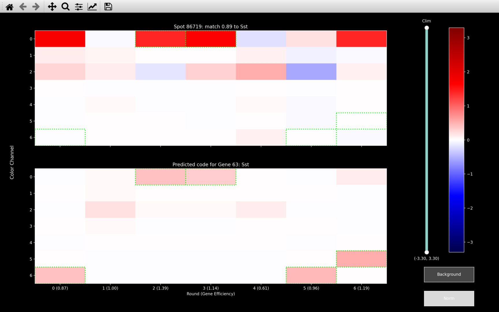
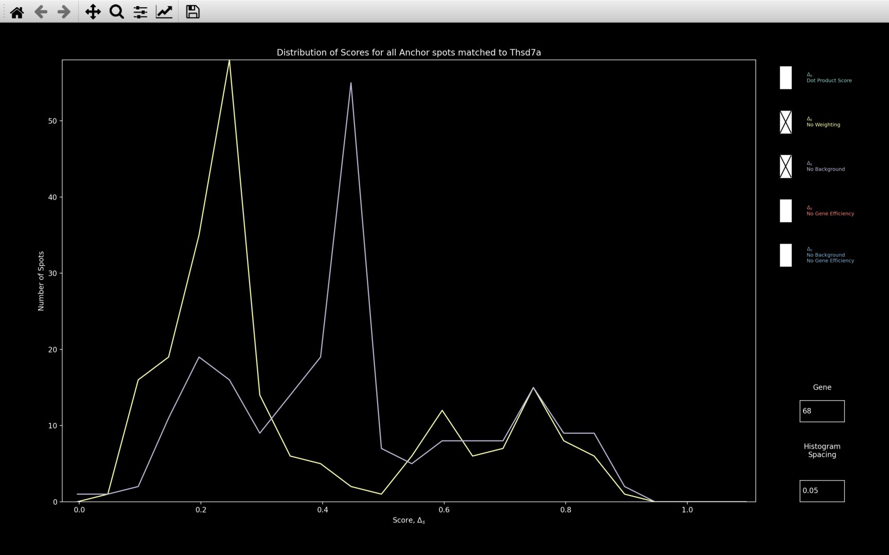
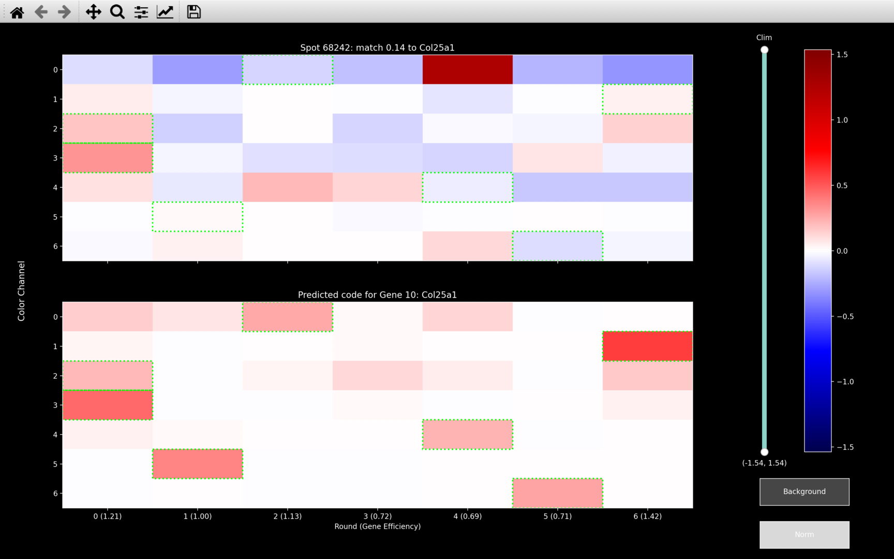
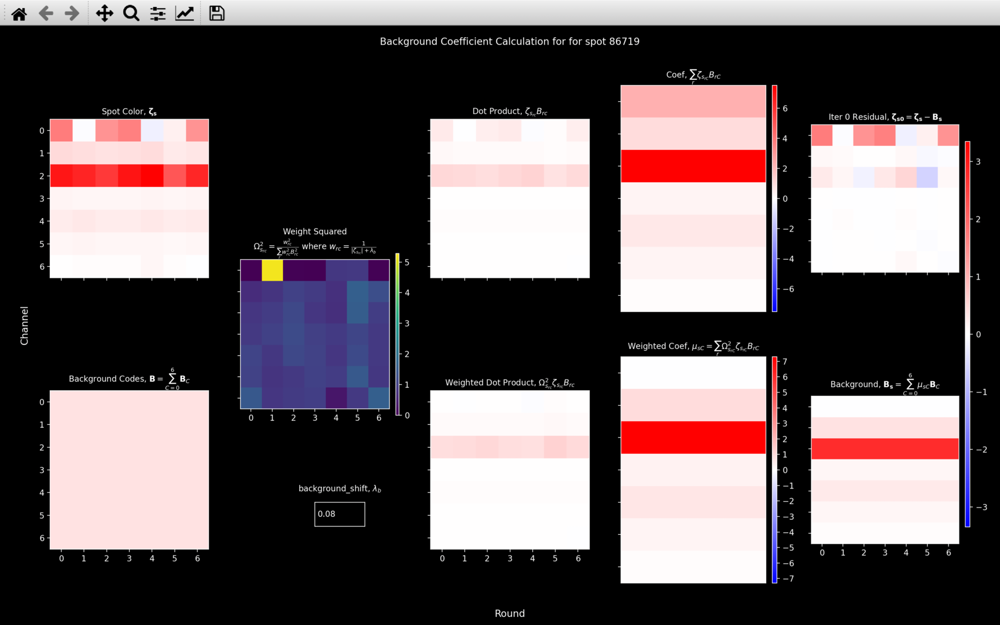

# Call Reference Spots
The [*call reference spots* step of the pipeline](../code/pipeline/call_reference_spots.md) uses the 
$n_{rounds} \times n_{channels}$  `color` obtained for each reference spot 
(detected on the reference round/reference channel ($r_{ref}$/$c_{ref}$) in the 
[*get reference spots*](get_reference_spots.md) step of the pipeline to compute the `bleed_matrix` accounting
for crosstalk between color channels. We then compute the `gene_efficiency` which allows for varying round
strengths for each gene, before assigning each reference spot to a gene.

These gene assignments are saved in the [`ref_spots`](../notebook_comments.md#ref_spots) *NotebookPage* 
while the bleed_matrix and expected bled_code for each gene are saved in the 
[`call_spots`](../notebook_comments.md#call_spots) *NotebookPage*.

!!! note "Note: `config` in this section means `config['call_spots']`"

## Gene Assignment
### Color Normalisation
We assign a spot $s$ to a gene $g$, based on its $n_{rounds} \times n_{channels}$ `color`, $\pmb{\acute{\zeta}_s}$, 
indicating the intensity in each round and channel.

However, we first need to equalize color channels, so that no one color channel dominates the others when 
it comes to gene assignment. The normalised `spot_colors`, $\pmb{\zeta}$, are obtained by dividing the saved 
`spot_colors`, $\pmb{\acute{\zeta}}$, by a $n_{rounds} \times n_{channels}$ 
normalisation factor, `nb.call_spots.color_norm_factor`.

??? question "Why do we need to normalise color channels?"

    The gene assignment of the spot below indicates why we need to normalise color channels.
    With no normalisation, the gene assignment is overly influenced by channel 4 which 
    is one of the most intense channels (see `color_norm_factor` in example box below). Thus it matches 
    to *Reln* which appears in channel 4 in rounds 0, 1, 5 and 6. It also doesn't care at all about 
    channel 2 because it is the weakest channel and *Reln* does not appear in channel 2 in any rounds.

    With normalisation, the most obvious effect is channel 2 gets boosted and now has an influence.
    Given that *Id2* appears in channel 2 in rounds 1, 3, 5 and 6, if channel 2 was never considered,
    it would always make the score to *Id2* low. When we include channel 2 though, we get a high score
    even though we are not matching the round 0, channel 4 intensity which contributed to the *Reln* assignment
    without normalisation.
    
    === "No Normalisation"
        {width="800"}

    === "With Normalisation"
        {width="800"}

This is [obtained](../code/call_spots/base.md#iss.call_spots.base.color_normalisation) 
using the parameters `config['color_norm_intensities']` and 
`config['color_norm_probs']` such that for each round, $r$, and channel $c$, 
the probability of $\zeta_{rc}$ being larger than 
`config['color_norm_intensities'][i]` is less than `config['color_norm_probs'][i]` for each $i$.

The probabilities come from the [histograms](extract.md#hist_counts) produced in the *extract and filter* step i.e.
if `config['color_norm_intensities'] = 0.5` and `config['color_norm_probs'] = 0.01`, then 
in each round and channel, only 1% of pixels on the mid z-plane across all tiles would have $\zeta_{rc} > 0.5$.

If `config[bleed_matrix_method] = 'single'`, then we combine all rounds for each channel so that 
`nb.call_spots.color_norm_factor[r, c]` is the same for all $r$ of a particular $c$. 

??? example

    With `config['color_norm_intensities'] = 0.5, 1, 5` and `config['color_norm_probs'] = 0.01, 5e-4, 1e-5`
    and the [histograms](extract.md#hist_counts) shown in the *extract and filter* step, the two
    methods of `config[bleed_matrix_method]` produce the following `color_norm_factor`:
    
    === "Single"
        {width="500"}

    === "Separate"
        {width="500"}

    The [normalised histogram](extract.md#hist_counts) shown was normalised using the *Single* `color_norm_factor`
    and you can see that for each round and channel there is a similar area under the curve
    (probability) beyond $\zeta_{rc}=0.5$, as expected from `config['color_norm_intensities']`.

### Background
After we have the normalised spot colors, $\pmb{\zeta}$, we 
[remove](../code/call_spots/background.md#iss.call_spots.background.fit_background) some background *genes* from them. 
There is one background *gene* for each channel, $\pmb{B}_C$. The background *gene* for channel $C$ is defined by:
$\pmb{B}_{C_{rc}}$ if $c = C$ and 0 otherwise i.e. it is just a strip in channel $C$:

{width="300"}

It is also normalised to have an L2 norm of 1. These are saved as `nb.call_spots.background_codes`.

??? question "Why do we need to fit background *genes*?"

    We fit the background *genes* because it is fairly common for $\pmb{\zeta}_s$ to have high intensity 
    across all rounds of a channel as shown for the example [`view_codes`](../view_results.md#c-view_codes) 
    plot below:
    
    === "No Background Removal"
        {width="500"}

    === "With Background Removal"
        {width="500"}

    Now no gene in the codebook looks that much like a background gene but if the background genes have not
    been fit, as with the first image above, spots like this will match to the gene which has the most 
    rounds in the relavent channel/s. Here, *Thsd7a* has intensity in channel 2 in all rounds apart from round 2.
    This problem will be exacerbated in the omp step, because at each iteration of the omp algorithm, 
    it will just try and fit more and more genes to explain the intense channel.

    If we do remove background though, as with the second image, the gene assignment will be based 
    on the other channels where not all rounds were intense. In this case, we get a match to *Sst* due
    to round 2 and 3 in channel 0.

    If we look at [`histogram_score`](#histogram_score) for *Thsd7a*, we see that wihtout background removal
    (purple), the peak in score is significantly larger:

    {width="500"}

    This indicates that without background removal, we would end up with a lot more spots assigned to
    genes like *Thsd7a* which have high intensity in most rounds of a single channel.
    

The coefficient, $\mu_{sC}$, for the channel $C$ background *gene*, $\pmb{B}_C$, fit to the spot $s$ color, 
$\pmb{\zeta}_s$ is:

$$
\mu_{sC} = \frac{\sum_rw^2_{rC}\zeta_{s_{rC}}B_{C_{rC}}}{\sum_rw^2_{rC}B^2_{C_{rC}}}; 
w_{rC} = \frac{1}{|\zeta_{s_{rC}}| + \lambda_b}
$$

Where, $\lambda_b$ is `config['background_weight_shift']` and the sum is over all rounds used.

??? note "Value of $\lambda_b$"

    If `config['background_weight_shift']` is left blank, it is set to the median of the [`intensity`](#intensity) 
    computed from the absolute colors of all pixels in the middle z-plane 
    (`nb.call_spots.norm_shift_tile`) of the central tile (`nb.call_spots.norm_shift_z`).

    This is because it gives an estimate of what $|\zeta_{s_{rC}}|$ would be for an average non-spot pixel.
    If we set $\lambda_b$ to be equal to this, it is saying that if a spot had a round and channel with very
    low intensity, then that round and channel would have as much influence on the final coefficient
    as an average pixel. 

    If $\lambda_b = 0$, then $w_{rc}$ would go to $\infty$ for low intensity rounds and channels,
    so the value of $\lambda_b$ chosen also provides an upper bound onthe contribution of low intensity 
    rounds and channels to the final coefficient.

If the weighting, $w$, was a constant across rounds and channels ($\lambda_b = \infty$), this would just be 
the least squares solution. After we have found the coefficients, we remove the background contribution
from the spot colors to give $\pmb{\zeta_{{s0}}}$ which we use from now on.

$$
\zeta_{{s0}_{rC}} = \zeta_{{s}_{rC}} - \mu_{sC}B_{C_{rC}}
$$

??? question "Why do we need a weighting?"
    
    We find $\mu_{sC}$ via weighted least squares, because it limits the influence of outliers. 
    The example below shows that with $\lambda_b = \infty$ (normal least squares), really tries to remove
    the outlier in round 4, channel 0. The result of this is that all the other rounds of channel 0 become 
    very negative.
    
    === "$\pmb{\zeta}_s$"
        {width="600"}
    === "$\pmb{\zeta}_{s0} (\lambda_b = 0.08)$"
        {width="600"}
    === "$\pmb{\zeta}_{s0} (\lambda_b = \infty)$"
        {width="600"}
    
    This spot should be *Slc6a1* as shown from the $\lambda_b = 0.08$ image but *Slc6a1* is expected to be 
    in 4 of the 6 rounds that were set to negative by the background fitting with $\lambda_b = \infty$.
    Thus, this spot can no longer be assigned to the correct gene after $\lambda_b = \infty$ background fitting.
    
    So basically, the job of the background fitting is to remove intensity in a particular channel if 
    that channel is intense across all rounds. This is because there are no actual genes which can explain this.
    We do not want it to tone down outlier rounds and channels because outliers are usually due to actual genes.

#### [`view_background`](../code/plot/call_spots.md#view_background)
The background coefficient calculation can be visualised by using the 
[`view_background`](../code/plot/call_spots.md#view_background) function:

{width="800"}

For each plot, each row corresponds to a different background *gene* coefficient calculation i.e. a different 
channel. There is no overlap between the background codes hence we can view all the calculations at the same time.

In the bottom row, round $r$, channel $c$ in the *Weighted Dot Product* plot refers to the value
of $\frac{w^2_{rc}\zeta_{s_{rc}}B_{C_{rc}}}{\sum_rw^2_{rC}B^2_{C_{rC}}}$. 
In the top row, the *Dot Product* plot is the same as the *Weighted Dot Product* plot except $\lambda_b = \infty$.

The bottom row *Weighted Coef* plot thus shows the coefficient computed for the current value of $\lambda_b$ 
(0.08 here, but can be specified with in the textbox). The top row *Coef* plot shows the coefficient that would
be computed with $\lambda_b = \infty$.

The main difference between the two in this case is that the channel 0 coefficient is much larger for the
$\lambda_b = \infty$ case. This is because the *Weight Squared*, $\Omega^2_{s_{rc}}$ term acts to increase the
contribution of the weak round 1, channel 0 and decrease the contribution of the strong rounds: 0, 2, 3 and 6.

### Bleed Matrix

## Intensity

## Diagnostics
### [`histogram_score`](../code/plot/omp.md#histogram_score)