# Extract and Filter

The [extract and filter step of the pipeline](../code/pipeline/extract_run.md) loads in the raw images, 
filters them and saves the resultant filtered images for each tile/round/channel combination 
as [npy files](../config_setup.md#tile_dir).

It also adds the [`extract`](../notebook_comments.md#extract) and 
[`extract_debug`](../notebook_comments.md#extract_debug) *NotebookPages* to the *Notebook*.

If the extract and filter step of the pipeline bugs out halfway through for some reason, it can be re-run
without needing to remake all the tiles already saved to the [tile directory](../config_setup.md#tile_dir).
It will just start with the first tile yet to be saved. 
The [scale](#scale) values must not be changed when re-running though.

## Variables in `extract` page
### `auto_thresh`
The [`extract`](../notebook_comments.md#extract) *NotebookPage* contains the variable `auto_thresh`.
`auto_thresh[t, r, c]` is the threshold spot intensity for tile $t$, round $r$, channel $c$ used for spot detection 
in the `find_spots` step of the pipeline.

`auto_thresh[t, r, c]` is set to `config['extract']['auto_thresh_multiplier'] * median(abs(image))` where
`image` is the mid z-plane (`nb.extract_debug.z_info`) of the image saved to `tile_dir` for tile $t$, round $r$, 
channel $c$ during the extract step of the pipeline.
This is just saying that we expect `median(abs(image))` to be the characteristic intensity of background pixels
and spot pixels should be much more intense that this.

These values can be viewed with the function [`thresh_box_plots`](../code/plot/extract.md#thresh_box_plots):

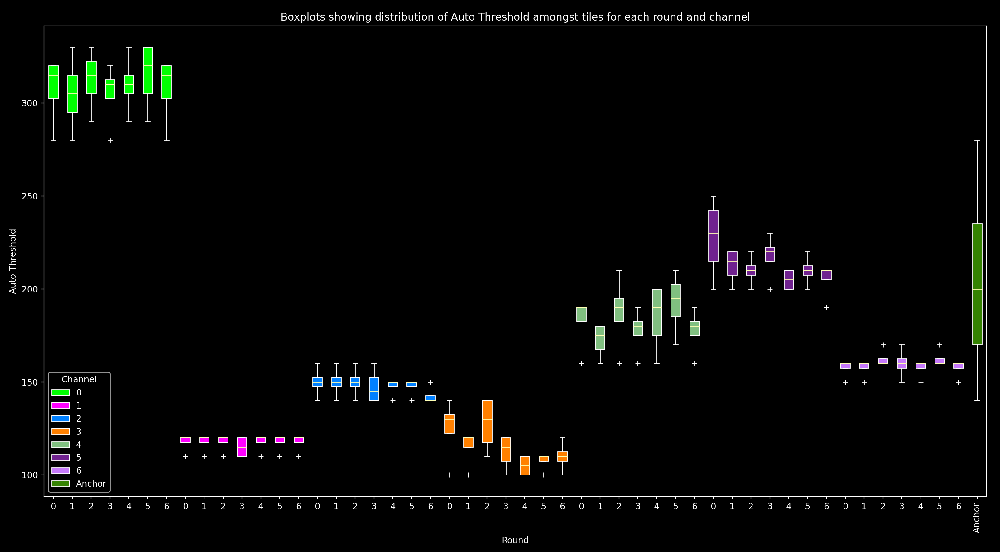{width="800"}

For each round and channel, this shows a box plot combining all tiles (i.e. a box plot of `auto_thresh[:, r, c]`).
For the `anchor_round`, only one channel (`anchor_channel`) is shown as it is the only one used on this round.
In this plot, we expect for a given channel, `auto_thresh` should be similar across all rounds and tiles (i.e.
boxplots of the same color should be at the same height, and they should have quite small ranges with any 
outlier tiles (white crosses, +) not far from the boxplot). 


### `hist_counts`
The [`extract`](../notebook_comments.md#extract) *NotebookPage* also contains the variable `hist_counts`.
`hist_counts[i, r, c]` is the number of pixels across the mid z-plane (`nb.extract_debug.z_info`) 
of all tiles in round $r$, channel $c$ which had the value `nb.extract.hist_values[i]`. 
It is used for [normalisation](../code/call_spots/base.md#iss.call_spots.base.color_normalisation) 
(see *Norm Button* box [here](../view_results.md#b-view_bleed_matrix)) 
between channels in the `call_reference_spots` step.

The histograms can be viewed using [`histogram_plots`](../code/plot/extract.md#histogram_plots).
Initially, this will show the `hist_counts[:, r, c]` vs `hist_values` for each round and channel.
There is also a *Norm Button* which 
[equalises the channels](../code/call_spots/base.md#iss.call_spots.base.color_normalisation) according to 
[`config['call_spots']['color_norm_intensities']`](../config.md#call_spots)
and [`config['call_spots']['color_norm_probs']`](../config.md#call_spots). In the normalised histograms,
most values will be between ±1.

=== "Un-normalised Histograms"
    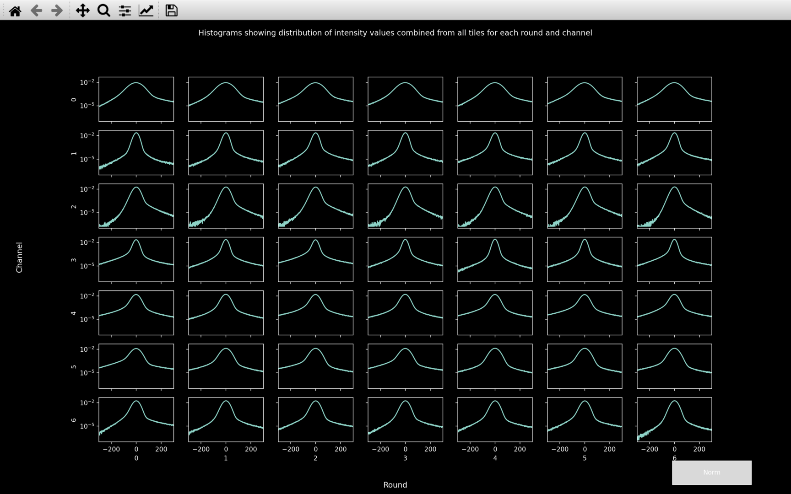{width="800"}

=== "Normalised Histograms"
    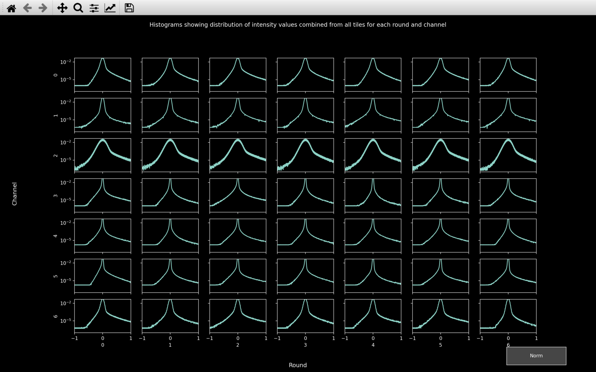{width="800"}

In the normalised histograms, we want to see a sharp peak at 0 accounting for the background pixels with a 
long tail to larger values accounting for the spot pixels and a tail to 
[negative values](#effect-of-filtering) accounting for the pixels in annuli surrounding spots.

So in this example, channel 2 will likely prove the most problematic because the peak centered on 0 is much wider
than for any other channel. This indicates that there is quite a lot of variance in the background pixels, 
making it harder to distinguish the spots from the background.

Also, from the un-normalised histograms we can see that the peak centered on 0 is widest for channel 0. 
Thus, the median of absolute values will be largest for this channel. This explains why [`auto_thresh`](#auto_thresh) 
is significantly larger for channel 0 than any other channel.


## Raw data
The raw data can be viewed using [`view_raw`](../code/plot/raw.md#iss.plot.raw.view_raw). It can either be called
for an experiment which already has a *Notebook* or for one which no code has been run yet but the `config_file` 
has been made:

=== "With *Notebook*"

    ``` python
    from iss import Notebook
    from iss.plot import view_raw
    nb_file = '/Users/user/iss/experiment/notebook.npz'
    nb = Notebook(nb_file)
    tiles = [0, 1]      # tiles to view
    rounds = [3, 5]     # rounds to view
    channels = [1, 6]   # channels to view
    view_raw(nb, tiles, rounds, channels)
    ```

=== "Without *Notebook*"

    ``` python
    from iss.plot import view_raw
    ini_file = '/Users/user/iss/experiment/settings.ini'
    tiles = [0, 1]      # tiles to view
    rounds = [3, 5]     # rounds to view
    channels = [1, 6]   # channels to view
    view_raw(None, tiles, rounds, channels, config_file=ini_file)
    ```

This will open a napari viewer with up to 4 scrollbars to change tile, round, channel and z-plane.
When any of these scrollbars are used, the status in the bottom left corner will indicate the current tile, round, 
channel and z-plane being shown (e.g. below, the round at index 0 is 3 and the channel at index 1 is 6).

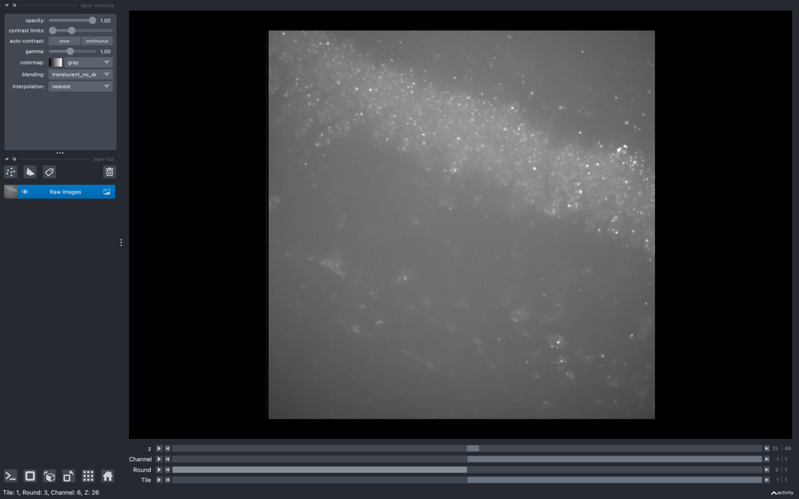{width="800"}

Using this tool before running the pipeline may be useful for deciding which z-planes to use.
For example, if say the first 10 z-planes don't show any clear spots, then [removing them with
`use_z`](../config_setup.md#using-a-subset-of-the-raw-data) in the [*basic_info*](../config.md#basic_info) 
section of the configuration file would make the pipeline run much quicker, 
especially in the [*omp*](omp.md) and [*extract and filter*](#extract-and-filter) sections.

## Filtering
Once the raw images are loaded in, they are 
[convolved](../code/utils/morphology.md#iss.utils.morphology.base.convolve_2d) with a *2D* 
[difference of hanning kernel](../code/utils/morphology.md#iss.utils.morphology.base.hanning_diff).

??? note "Difference with *2D* pipeline"
    
    If `config['basic_info']['is_3d'] == False`, before the convolution with the difference of hanning kernel,
    the *3D* raw data will be [focus stacked](../code/extract/fstack.md#iss.extract.fstack.focus_stack) so that 
    it becomes *2D*.

### Difference of hanning kernel
The [difference of hanning kernel](../code/utils/morphology.md#iss.utils.morphology.base.hanning_diff) is made up
by adding together a positive hanning window (yellow below) of radius $r_1$ and an outer negative hanning window 
(cyan below) of radius of $r_2$ (typically twice $r_1$).
It is normalised such that the sum of the difference of hanning kernel is 0. An example for a *1D* version of the 
kernel with $r_1 = 3$ and $r_2 = 6$:

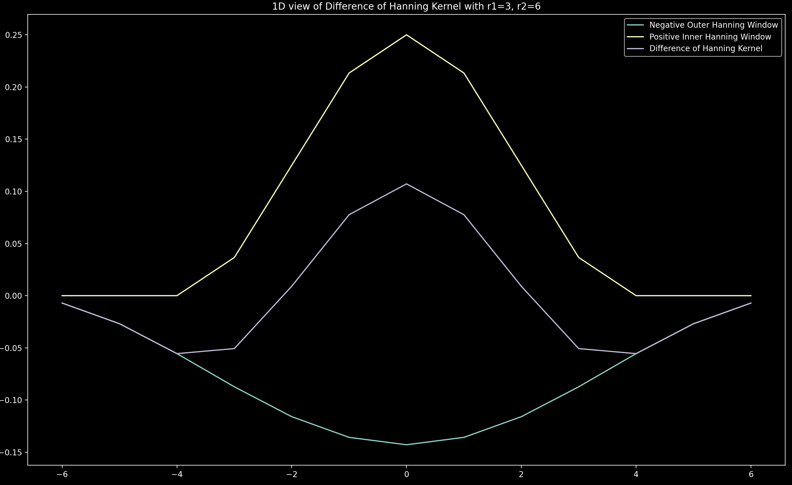{width="800"}

??? note "Conversion to *2D*"

    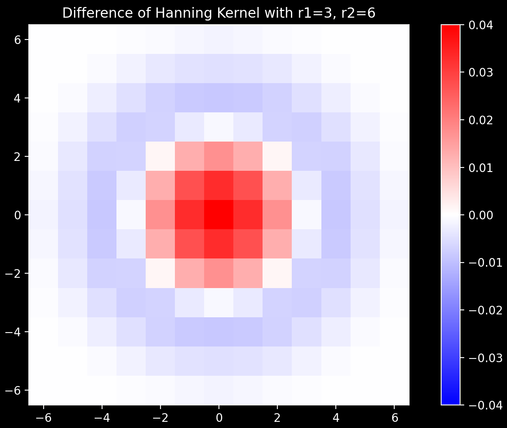{width="400", align=right}
    
    The *1D* kernel shown in purple above is converted to the *2D* kernel shown on the right via the 
    [`ftrans2`](../code/utils/morphology.md#iss.utils.morphology.base.ftrans2) function.

In the pipeline, the value of $r_1$ is set to [`config['extract']['r1']`](../config.md#extract) 
and $r_2$ is set to `config['extract']['r2']`.
If `config['extract']['r1']` is not specified, it is converted to units of pixels from the micron value
`config['extract']['r1_auto_microns']` (0.5$\mu$m typically gives $r_1=3$). If `config['extract']['r2']` is not 
specified, $r_2$ is set to twice $r_1$. 

In general, $r_1$ should be the typical radius of a spot in the raw image and $r_2$ should be twice this.

### Smoothing
After the convolution with the difference of hanning kernel, there is an option to smooth the image by applying 
a [correlation](../code/utils/morphology.md#iss.utils.morphology.filter.imfilter) with an averaging kernel.
This can be included by setting the [`config['extract']['r_smooth']`](../config_setup.md#extractr_smooth) parameter. 


### DAPI
For the `dapi_channel` of the `anchor_round`, convolution with the difference of hanning kernel is not appropriate 
as the features that need extracting do not look like spots. Instead, tophat filtering can be performed by 
setting [`config['extract']['r_dapi']`](../config_setup.md#extractr_dapi) and no smoothing is permitted.


## Viewer
The purpose of filtering the raw images is to make the spots appear much more prominently compared to the background 
i.e. it is to extract the spots. We can see this effect and how the various parameters affect things with 
[`view_filter`](../code/plot/extract.md#iss.plot.extract.view_filter). 
This can be called in a similar way to [`view_raw`](#raw-data):

=== "With *Notebook*"

    ``` python
    from iss import Notebook
    from iss.plot import view_filter
    nb_file = '/Users/user/iss/experiment/notebook.npz'
    nb = Notebook(nb_file)
    t = 1       # tile to view
    r = 3       # round to view
    c = 6       # channel to view
    view_filter(nb, t, r, c)
    ```

=== "Without *Notebook*"

    ``` python
    from iss.plot import view_filter
    ini_file = '/Users/user/iss/experiment/settings.ini'
    t = 1       # tile to view
    r = 3       # round to view
    c = 6       # channel to view
    view_filter(None, t, r, c, config_file=ini_file)
    ```

This will open a napari viewer with up to 2 scrollbars. One to change z-plane and another to change the filter method.
The filter method scrollbar can change between the raw image, the result of convolution with difference of hanning 
kernel and the result with smoothing in addition to this.

There are also up to 3 of the following sliders in the bottom left:

* *Difference of Hanning Radius*: This is the value of `config['extract']['r1']`. 
Whenever this is changed, `config['extract']['r2']` will be set to twice the new value.
* *Tophat kernel radius*: If `r == anchor_round` and `c == dapi_channel`, this slider will appear and refers to the 
value of `config['extract']['r_dapi']`.
* *Smooth Radius YX*: This is the value of `config['extract']['r_smooth'][0]` and `config['extract']['r_smooth'][1]`.
Both will be set to the same value.
* *Smooth Radius Z*: This is the value of `config['extract']['r_smooth'][2]`. When both this slider and 
the *Smooth Radius YX* slider are set to 1, no smoothing will be performed and the last two images in the filter method
scrollbar will be identical.

Whenever any of these are changed, the filtering will be redone using the new values of the parameters
and thus the last two images of the filter method scrollbar will be updated.
The time taken will be printed to the console.

The *1D* version of the current difference of hanning kernel can be seen at any time by pressing the *h* key.

### Effect of Filtering
The images below show the effect of filtering with `config['extract']['r1'] = 3`, `config['extract']['r2'] = 6`
and `config['extract']['r_smooth'] = 1, 1, 2`:

=== "Raw"
    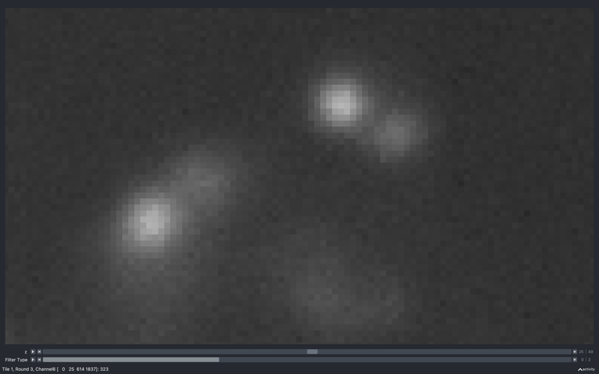{width="800"}

=== "Difference of Hanning Convolution"
    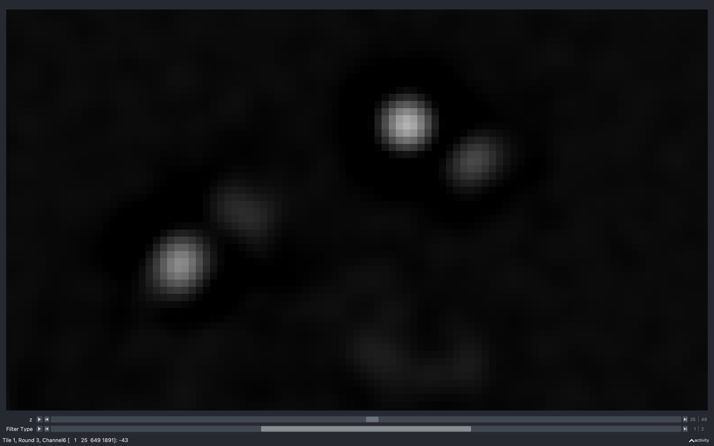{width="800"}

=== "Smoothing"
    {width="800"}

From this, we see that away from the spots, the raw image has a non-zero intensity value (around 300). After
convolution with the difference of hanning kernel though, these regions become a lot darker (approximately 0). This
is because the sum of the difference of hanning kernel is 0 so its effect on a background region with a uniform 
non-zero value is to set it to 0.

Looking at the spots, we see that the convolution helps isolate the spots from the background and separate
spots which are close together. There is also a very dark (negative) region surrounding the spots. 
It is a feature of convolution with the difference of hanning kernel that it produces a negative annulus
about spots. This is because, the result of 

??? note "Why negative annulus is expected"

    The convolution in the annulus of a spot is like the sum of the multiplication of the spot line (yellow)
    with the kernel line (cyan). This multiplication produces the purple line, the sum of which is negative.

    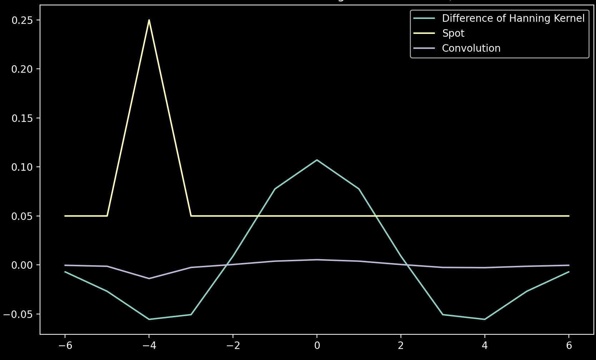{width="600"}

The smoothing in this example is only in the z direction (averaging over 3 z-planes: the one shown, 1 above and 1 below)
and seems to emphasise the spots and the negative annulus even more. 
This is because on one of the neighbouring z-planes, the spot has a larger intensity than on the z-plane shown so 
averaging increases the absolute intensity.

### Varying difference of hanning kernel radius
The below plots show the results of the convolution with the difference of hanning kernel for four different values
of `config['extract']['r1']`. In each case, `config['extract']['r2']` is twice this value.

=== "2"
    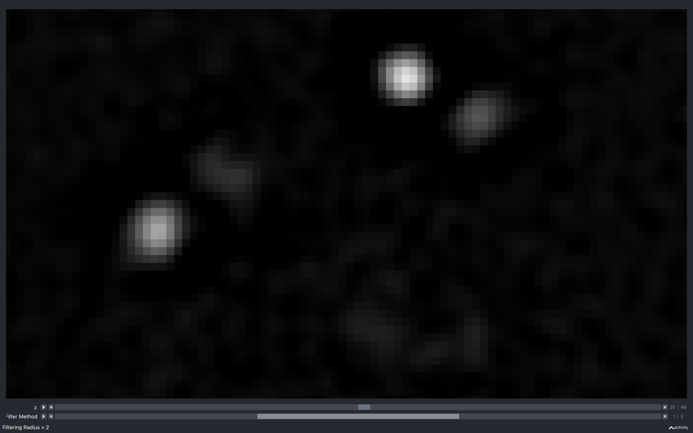{width="800"}

=== "3"
    {width="800"}

=== "4"
    {width="800"}

=== "6"
    {width="800"}

From this, we see that with $r_1 = 2$, the background regions away from the spots appear less uniform than with
$r_1 = 3$ with quite a few patches of negative values. Also, the shape of the second spot from the left appears
distorted. These both indicate that the kernel is wanting to extract features smaller than those of interest.

As $r_1$ increases, we see that the negative annulus around becomes larger and eventually at $r_1=6$, the spots 
start merging together indicating the kernel is wanting to extract features larger than those of interest.

### Varying smoothing radius
The below plots show the results of the convolution with the difference of hanning kernel followed by smoothing
for four different values of `config['extract']['r_smooth']`. In each case, `config['extract']['r1'] = 3` and 
`config['extract']['r2'] = 6`.

=== "1, 1, 2"
    {width="800"}

=== "1, 1, 3"
    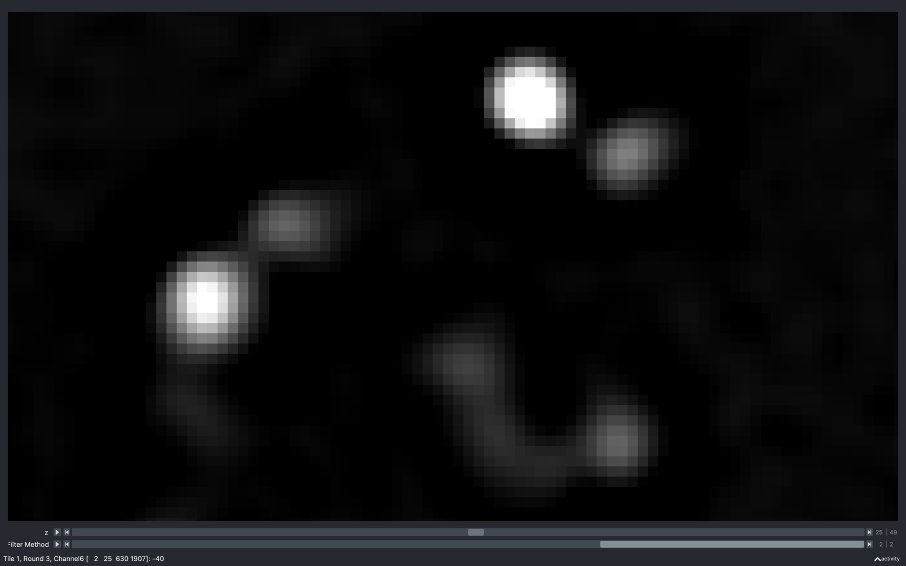{width="800"}

=== "1, 1, 5"
    {width="800"}

=== "2, 2, 2"
    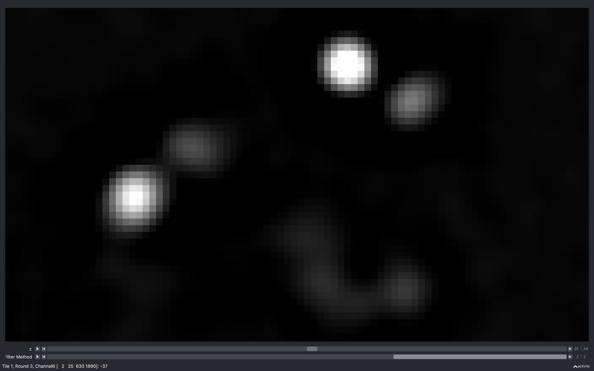{width="800"}

=== "4, 4, 1"
    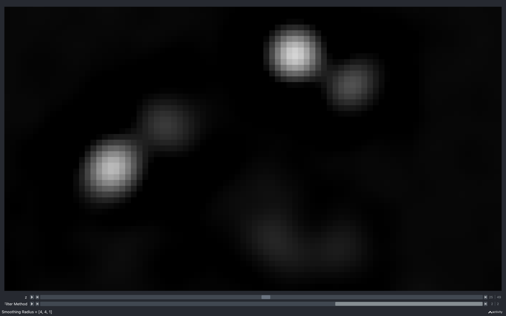{width="800"}

From this, we see that smoothing in the z direction makes spots which appear most prominantly on other z-planes
appear much more intense in the z-plane shown. For example, the feature towards the bottom just to right of centre
is barely visible with `r_smooth = 1, 1, 2` but is clear with `r_smooth = 1, 1, 5`.

We also see that the difference between the `r_smooth = 1, 1, 2` and `r_smooth = 2, 2, 2` plots is barely perceivable.
This suggests that the z averaging is more important, this also makes sense seen as the convolution with the 
difference of hanning kernel is done in *2D* so treats each z-plane independently. In the `r_smooth = 4, 4, 1` image
with no z-averaging, we see that the spots have more of a gradual increase in intensity instead of a sharp peak.


## Scale
The filtered images produced are of *float* data type with negatives, 
but they are saved to `config['file_names']['tile_dir']` in *uint16* format.

To do this conversion, the images are first multiplied by a scale factor so that they fill most of the *uint16* 
range (between 0 and 65535) to keep the maximum amount of information. There are two different scale factors,
`scale` which is applied to all tiles and channels of the imaging rounds 
(`config['file_names']['round']`) and `scale_anchor` which is applied to all tiles of 
the `anchor_channel` of the `anchor_round`.

??? error "Potential error if `scale` changed"

    It is important that the value of `scale` used does not vary between tiles/rounds/channels as
    it would affect the assignment of spots to genes. For example, if the value of `config['extract']['scale']` 
    was larger for round 2, channel 3, then spots will be more likely to be assigned to 
    genes which appear here according to their barcode in the [`code_book`](../config_setup.md#code_book)
    (`scale_anchor` is allowed to differ from `scale` because the `anchor_round` is not used in gene assignment).
    
    To stop this possibility, the values of `scale` and `scale_anchor` used
    are [saved](../code/extract/scale.md#save_scale) to the `config['file_names']['tile_dir']` 
    in a text file (`config['file_names']['scale']`).
    Then if these [differ](../code/extract/scale.md#iss.extract.scale.get_scale_from_txt) 
    from `config['extract']['scale']` and `config['extract']['scale_anchor']`, an error will occur.

`scale` can be specified through `config['extract']['scale']` but if this is empty, it will be 
[set](../code/extract/scale.md#iss.extract.scale.get_scale)
to `scale = config['extract']['scale_norm']/max(scale_image)`. `scale_image` is the 
`nb.basic_info.tile_sz x nb.basic_info.tile_sz` raw image belonging to the channel and z-plane containing 
the pixel with maximum intensity of the central tile (saved as `scale_channel`, `scale_z`, `scale_tile` in 
[`nb.extract_debug`](../notebook_comments.md#extract_debug)) in round 0. It is then filtered/smoothed according
to the parameters in `config['extract']` before being used in the `scale` calculation.

`scale_anchor` can be specified through `config['extract']['scale_anchor']`. If it is left empty,
it is [computed](../code/extract/scale.md#iss.extract.scale.get_scale) in the same way as `scale` 
(the channel used is `anchor_channel` and the tile and z-plane used are saved as `scale_ancor_tile` and 
`scale_anchor_z` in [`nb.extract_debug`](../notebook_comments.md#extract_debug)).

After the tiles are multiplied by the scale factor, they still contain negative values, so
when they are [saved](../code/utils/npy.md#iss.utils.npy.save_tile), a shift 
(`config['basic_info']['tile_pixel_value_shift']`) in intensity is added to each pixel.
This shift is then subtracted when the tiles are [loaded](../code/utils/npy.md#iss.utils.npy.load_tile).

### Potential error with clipped pixels
Because `scale` is computed from one tile and round, there is a possibility during the course
of the extract step of the pipeline that a much more intense tile/round will be encountered such that 
the pixel values will have to be clipped after scaling to be kept within the *uint16* range.

The number of pixels for which this happens on tile $t$, round $r$, channel $c$ is saved as 
[`nb.extract_debug.n_clip_pixels[t, r, c]`](../notebook_comments.md#extract_debug).

Clipped pixels can cause more spots to be detected in the find_spots section of the pipeline as shown 
below, so are best avoided:

=== "Spot detection with no clipped pixels"
    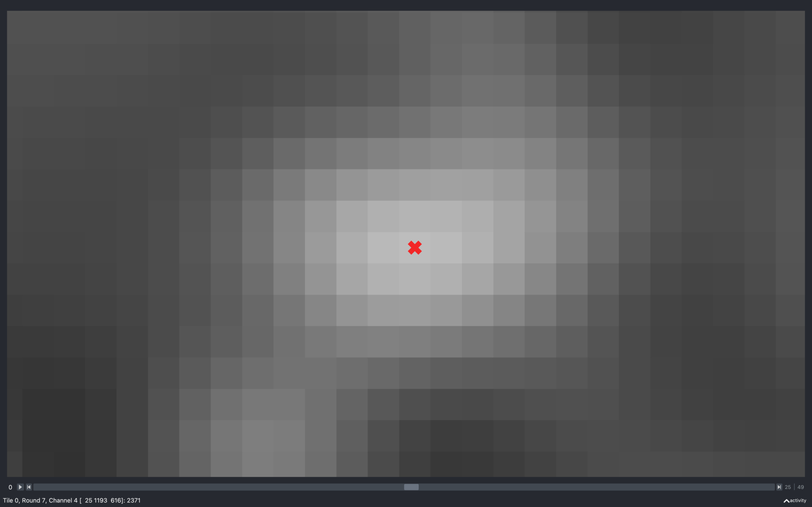{width="500"}

=== "Spot detection with clipped pixels"
    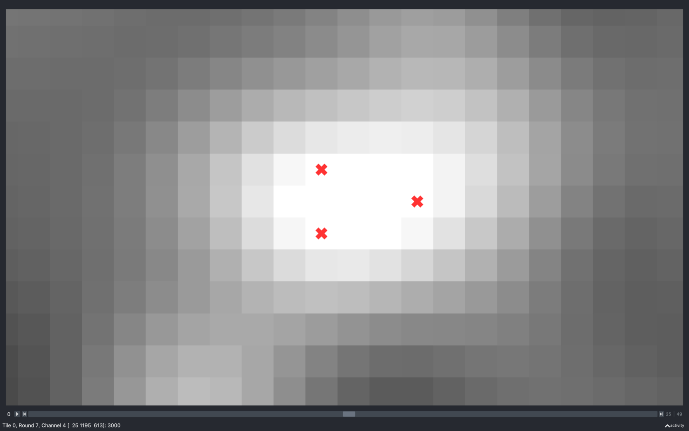{width="500"}

If more than `config['extract']['n_clip_error']` (will be set to 1% of pixels on single z-plane if not specified) 
pixels have been clipped for `config['extract']['n_clip_error_images_thresh']` images,
an error will be raised stopping the extract section of the pipeline. 
    
When this error occurs, a *Notebook* called *notebook_extract_error.npz* will be saved to the output directory
with the pages *extract_fail* and *extract_debug_fail*. `nb.extract_fail.fail_trc` records the tile, round, channel
where it terminated.

#### Solution
If the failed round, `nb.extract_fail.fail_trc[1]` is not the `anchor_round`, then delete everything in the tile
directory including the `scale.txt` file. Then set `config['extract']['scale']` to `new_scale` and re-run:

``` python
scale_clip = nb.extract_debug.clip_extract_scale
new_anchor_scale = scale_clip[scale_clip > 0].min()
```

This is the scale such that all tiles saved so far will not have any clipped pixels.

If the failed round, `nb.extract_fail.fail_trc[1]` is the `anchor_round`, then delete all .npy files belonging to
the anchor round in the tile directory as well as the `scale.txt` file. 
Then set `config['extract']['scale_anchor']` to `new_anchor_scale` and re-run:

``` python
anchor_scale_clip = \
    nb.extract_debug.clip_extract_scale[:, anchor_round, anchor_channel]
new_anchor_scale = anchor_scale_clip[anchor_scale_clip > 0].min()
```

This is the scale such that all anchor tiles saved so far will not have any clipped pixels.


## Psuedocode
This is the pseudocode outlining the basics of this [step of the pipeline](../code/pipeline/extract_run.md).

```
for r in use_rounds:
    for t in use_tiles:
        for c in use_channels:
            im = load image from raw data in input_dir
            if 2D:
                im = focus_stack(im)
            if r is anchor_round and c is dapi_channel:
                im = tophat_filter(im, dapi_kernel)
            else:
                im = convolve(im, diff_hanning_kernel)
                im = im * scale
                if smooth:
                    im = correlate(im, smooth_kernel)
                Compute auto_thresh[t, r, c] and hist_counts[t, r, c] from
                 mid z-plane of im.
                Save im to tile directory.
Add information needed for later stages of pipeline to extract NotebookPage
Add useful debugging info to extract_debug NotebookPage.
Return both.            
```