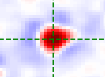
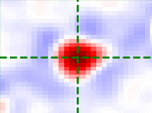
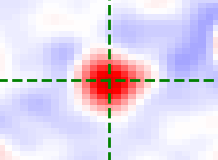
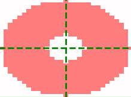
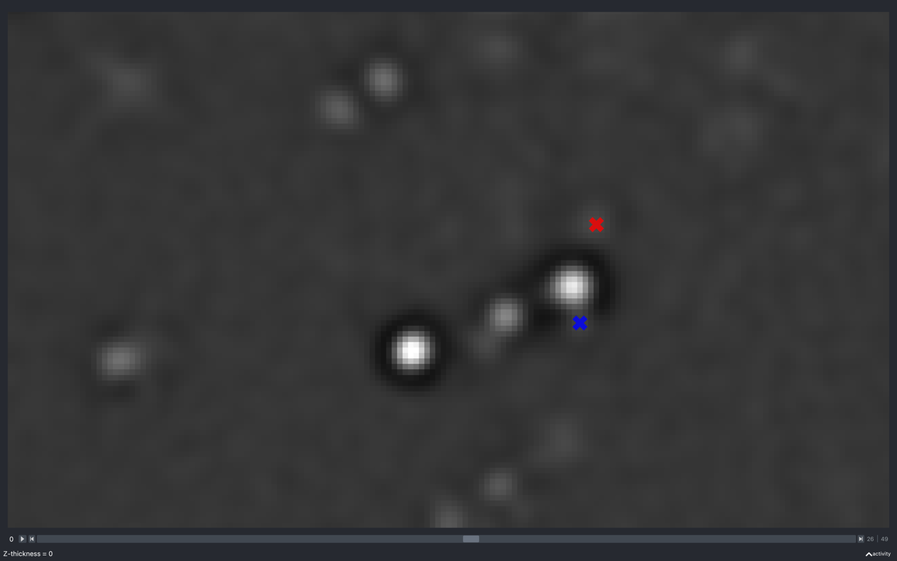
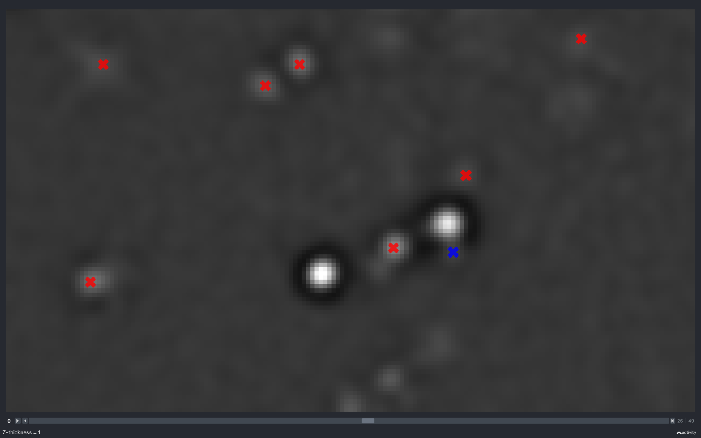
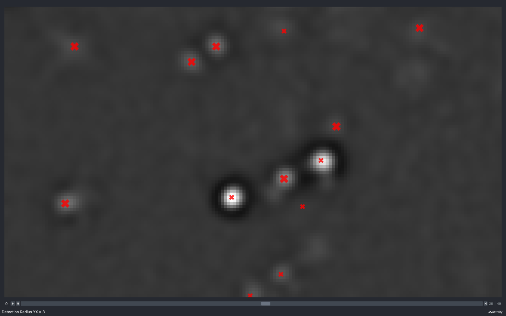
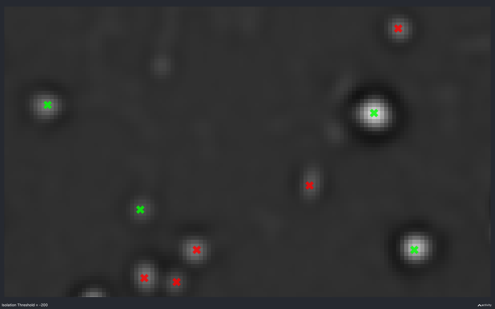

# Find Spots
The [find spots step of the pipeline](../code/pipeline/find_spots.md) loads in the filtered images for each 
tile, round, channel saved during the [extract step](extract.md) and detects spots on them. 
It is obtaining a point cloud from the images because in the stitch and register sections of the pipeline,
it is quicker to use point clouds than the full images.

The [`find_spots`](../notebook_comments.md#find_spots) *NotebookPage* is added to the *Notebook* after this stage
is finished.

## Spot detection
The spots on tile $t$, round $r$, channel $c$ [are](../code/find_spots/detect.md#iss.find_spots.detect.detect_spots) 
the local maxima in the filtered image (loaded in through 
[`load_tile(nb.file_names, nb.basic_info, t, r, c)`](../code/utils/npy.md#iss.utils.npy.load_tile)) 
with an intensity greater than [`auto_thresh[t, r, c]`](extract.md#auto_thresh).

Local maxima means pixel with the largest intensity in a neighbourhood defined by `config['find_spots']['radius_xy']`
and `config['find_spots']['radius_z']` (`kernel = np.ones((2*radius_xy-1, 2*radius_xy-1, 2*radius_z-1))`). 
The position of the local maxima is found to be where the 
[dilation](../code/utils/morphology.md#iss.utils.morphology.base.dilate) of the image with the `kernel` 
is equal to the image. 

The spot detection process can be visualised with [`view_find_spots`](#viewer).

??? note "Optimised spot detection"

    The dilation method is quite slow so if *jax* is installed, a 
    [different spot detection method](../code/find_spots/detect.md#iss.find_spots.detect_optimised.detect_spots) 
    is used.

    In this method, we look at all pixels with intensity greater than `auto_thresh[t, r, c]`. For each of these,
    we say that the pixel is a spot if it has a greater intensity than all of its neighbouring pixels, where the 
    neighbourhood is determined by the `kernel`. 

    The larger `auto_thresh[t, r, c]` and the smaller the `kernel`, the faster this method is, whereas the value
    of `auto_thresh[t, r, c]` makes no difference to the speed of the dilation method. In our case, 
    `auto_thresh[t, r, c]` is pretty large as the whole point is that all background pixels (the vast majority) 
    have intensity less than it.

    TODO: GIVE TIMES FOR THIS SECTION WITH THE TWO DIFFERENT METHODS

??? note "Dealing with duplicates"

    If there are two neighbouring pixels which have the same intensity which is the local maxima intensity, by default
    both pixels will be declared to be local maxima. However if `remove_duplicates == True` in 
    [`detect_spots`](../code/find_spots/detect.md#iss.find_spots.detect.detect_spots), only one will be deemed a 
    local maxima.

    This is achieved by adding a random shift to the intensity of each pixel. The max possible shift is 0.2 so it 
    will not change the integer version of the image but it will ensure each pixel has a different intensity to 
    its neighbour.

### Imaging spots
For non reference spots (all round/channel combinations apart from `ref_round`/`ref_channel`),
we only use the spots for registration to the reference spots so the quantity of
spots is not important. In fact, registration tends to work better if there are fewer but more reliable spots
as this means there is a lesser chance of matching up spots by chance. 

To exploit this, for each imaging tile $t$, round $r$, channel $c$ where $r$, the point cloud 
is made up of the `max_spots` most intense spots on each z-plane. In *2D*, `max_spots` is 
`config['find_spots']['max_spots_2d']` and in *3D*, it is `config['find_spots']['max_spots_3d']`.
If there are fewer than `max_spots` spots detected on a particular z-plane, all the spots will be kept.


### Reference spots
We want to assign a gene to each reference spot (`ref_round`/`ref_channel`) as well as use it for registration,
so it is beneficial to maximise the number of reference spots. As such, we do not do the `max_spots` thresholding
we do for [imaging spots](#imaging-spots).

However, we want to know which reference spots are isolated because when it comes to the 
[`bleed_matrix`](../code/call_spots/bleed_matrix.md#iss.call_spots.bleed_matrix.get_bleed_matrix) calculation,
we do not want to use overlapping spots.

#### Isolated spots
We deem a spot to be [isolated](../code/find_spots/base.md#iss.find_spots.base.get_isolated) 
if it has a prominent [negative annulus](extract.md#effect-of-filtering),
because if there was an overlapping spot, you would expect positive intensity in the annulus around the spot.
We find the intensity of the annulus by computing the correlation of the image with an 
annulus kernel obtained from [`annulus(r0, r_xy, r_z)`](../code/utils/strel.md#iss.utils.strel.annulus) where:

* `r0 = config['find_spots']['isolation_radius_inner']`
* `r_xy = config['find_spots']['isolation_radius_xy']` 
* `r_z = config['find_spots']['isolation_radius_z']`.

If the value of this correlation at the location of a spot is less than `config['find_spots']['isolation_thresh']`,
then we deem the spot to be isolated. If `config['find_spots']['isolation_thresh']` is not given, it is set to
`config['find_spots']['auto_isolation_thresh_multiplier'] * auto_thresh[t, r, c]`. 
The final isolation thresholds used for each round, tile, channel are saved as 
[nb.find_spots.isolation_thresh](../notebook_comments.md#find_spots). 
The process of obtaining isolated spots can be visualised with [`view_find_spots`](#isolation-threshold).

??? note "Annulus kernel"

    The annulus kernel should be equal to 1 over the pixels in the neighbourhood of an isolated spot 
    which are usually negative. The example images below show a typical spot (left) and the annulus
    kernel used for this data (right) with `r0 = 4`, `r_xy = 14` and `r_z = 1`. 
    The dimensions of each image is 29 x 29 pixels, red is positive and blue is negative.
    
    !!! example inline ""
        === "z = -1"
            {width="400"}
    
        === "z = 0"
            {width="400"}
    
        === "z = 1"
            {width="400"}

    !!! example inline end ""
        === "z = -1"
            {width="400"}
    
        === "z = 0"
            {width="400"}
    
        === "z = 1"
            {width="400"}

## Potential error with too few spots
After the `find_spots` *NotebookPage* has been [added](../code/pipeline/run.md#iss.pipeline.run.run_find_spots)
to the *Notebook*, [`check_n_spots`](../code/find_spots/base.md#iss.find_spots.base.check_n_spots) will be run.

This will produce a warning for any tile, round, channel for which fewer than

`n_spots_warn = config['find_spots']['n_spots_warn_fraction'] * max_spots * nb.basic_info.nz`

spots were detected, where `max_spots` is `config['find_spots']['max_spots_2d']` if *2D* and 
`config['find_spots']['max_spots_3d']` if *3D*. 

An error will be raised if any of the following is satisfied:

* For any given channel, the number of spots found was less than `n_spots_warn` for at least
the fraction `n_spots_error_fraction` of tiles/rounds.

    The faulty channels should then be removed from `use_channels`.

* For any given tile, the number of spots found was less than `n_spots_warn` for at least
the fraction `n_spots_error_fraction` of rounds/channels. 

    The faulty tiles should then be removed from `use_tiles`.

* For any given round, the number of spots found was less than `n_spots_warn` for at least
the fraction `n_spots_error_fraction` of tiles/channels.

    The faulty rounds should then be removed from `use_rounds`.

??? example

    The following is the $n_{tiles}$ (3) x $n_{rounds}$ (5) array of number of spots found for a given channel:
    
    ``` python
    spot_no = array([[1295, 1016,  869,  719,  829],
                     [1055,  888,  687,  556,  824],
                     [5901, 4208, 5160, 4069, 4006]])
    ```
    The value of `n_spots_warn` for this experiment is 3500 so a warning will be raised for
    the 10 tiles/rounds for which `spot_no[t, r] < n_spots_warn`:
    ``` python
    array([[0, 0],
           [0, 1],
           [0, 2],
           [0, 3],
           [0, 4],
           [1, 0],
           [1, 1],
           [1, 2],
           [1, 3],
           [1, 4]])
    ```
    The value of `n_spots_error_fraction` for this experiment is 0.5 so the threshold number of 
    failed tiles/rounds to give an error is $0.5 \times n_{tiles} \times n_{rounds} = 7.5$.
    We have 10 failed tiles/rounds so an error would be raised in this case.

The `use_tiles`, `use_rounds` and `use_channels` parameters can be changed without having to re-run
the `find_spots` section of the pipeline as explained [here](../notebook.md#changing-basic_info-mid-pipeline).
It tiles/rounds/channels are added instead of removed though, it will need re-running, as will the `extract` step.

## Viewer
We can see how the various parameters affect which spots are detected using 
[`view_find_spots`](../code/plot/find_spots.md#view_find_spots). 
This can be called as follows (in the *Without Notebook* case, the raw images will be loaded and 
then [filtered](extract.md#filtering) according to parameters in [`config['extract']`](../config.md#extract)).

=== "With *Notebook*"

    ``` python
    from iss import Notebook
    from iss.plot import view_find_spots
    nb_file = '/Users/user/iss/experiment/notebook.npz'
    nb = Notebook(nb_file)
    t = 1       # tile to view
    r = 3       # round to view
    c = 6       # channels to view
    view_find_spots(nb, t, r, c)
    ```

=== "Without *Notebook*"

    ``` python
    from iss.plot import view_filter
    ini_file = '/Users/user/iss/experiment/settings.ini'
    t = 1       # tile to view
    r = 3       # round to view
    c = 6       # channel to view
    view_find_spots(None, t, r, c, config_file=ini_file)
    ```
=== "Reference round/channel showing isolated spots"

    ``` python
    from iss import Notebook
    from iss.plot import view_find_spots
    nb_file = '/Users/user/iss/experiment/notebook.npz'
    nb = Notebook(nb_file)
    t = 1                               # tile to view
    r = nb.basic_info.ref_round         # round to view
    c = nb.basic_info.ref_channel       # channel to view
    view_find_spots(nb, t, r, c, show_isolated=True)
    ```

This will open a napari viewer with up to 5 sliders in the bottom left:

* [*Detection Radius YX*](#yx): This is the value of `config['find_spots']['r_xy']`.
* [*Detection Radius Z*](#z): This is the value of `config['find_spots']['r_z']`.
* [*Intensity Threshold*](#intensity-threshold): This is the value of `nb.extract.auto_thresh[t, r, c]`.
* [*Isolation Threshold*](#isolation-threshold): This is the value of `nb.find_spots.isolation_thresh[t, r, c]`.
It will only appear if `show_isolated == True`, `r = nb.basic_info.ref_round` and `c = nb.basic_info.ref_channel`.
* [*Z Thickness*](#z-thickness): Spots detected on the current z-plane and this many z-planes either side of it 
will be shown. Initially, this will be set to 1 so spots from the current z-plane and 1 either side of it will be shown. 

Whenever the first two are changed, the dilation will be redone using the new values of the radii and the 
time taken will be printed to the console. The correlation calculation required to determine which spots are 
[isolated](#isolated-spots) is slow hence by default `show_isolated == False`.

### Z thickness
The images below show the effect of changing the z-thickness. The size of the spots is related to the 
z-plane they were detected on. The closer to the current z-plane, the larger they appear:

=== "0"
    {width="400"}

=== "1"
    {width="400"}

=== "2"
    {width="400"}

The blue spot which has a 
[neighbouring pixel with negative intensity](../code/find_spots/base.md#iss.find_spots.base.check_neighbour_intensity) 
and is not kept in the final point cloud.


### Detection radius
#### YX
The images below show the effect of using the slider to change `config['find_spots']['r_xy']` with 
`config['find_spots']['r_z']` fixed at 2 and z thickness = 2:

=== "2"
    {width="400"}

=== "3"
    {width="400"}

=== "10"
    {width="400"}

Clearly, as the radius increases the spots have to be separated by a larger distance resulting in less spots found.

#### Z
The images below show the effect of using the slider to change `config['find_spots']['r_z']` 
with `config['find_spots']['r_yx']` fixed at 2 and z thickness = 2:

=== "2"
    {width="400"}

=== "6"
    {width="400"}

=== "12"
    {width="400"}

Again we see the number of spots reducing as this increases. However, it is less clear as to why because
the minimum separation in z is what is changing but, we are only seeing spots from 5 z-planes imposed on a
single z-plane.

### Intensity threshold
The images below show the effect of using the slider to change `nb.extract.auto_thresh[t, r, c]`. This is for a 
*2D* experiment with `config['find_spots']['r_yx'] = 2`.

=== "447"
    {width="400"}

=== "2234"
    {width="400"}

=== "4757"
    {width="400"}

This is useful to see what a suitable intensity threshold should be. For example, the 447 plot identifies
spots which do not look real while the 4757 plot misses some obvious spots.

The value of `nb.extract.auto_thresh[t, r, c]` obtained for this data is approximately 2234.

The green spots are those which are identified as isolated. 

#### Changing `auto_thresh`
If after playing with this slider, it is decided that the `find_spots` part of the pipeline should be run
(or re-run) with the updated intensity threshold, `new_thresh`, for tile $t$, round $r$, channel $c$, 
this can be achieved by setting `nb.extract.auto_thresh[t, r, c] = new_thresh`.

Note, this is an abuse of the rules of the *Notebook* as it is 
[changing a variable](../notebook.md#modifying-a-notebookpage) after it has been added 
and thus should not be allowed, but it does work. To keep the `new_thresh` value, the *Notebook* will need
saving after `nb.extract.auto_thresh` has been updated. It should be saved to a different location, so it does 
not overwrite the initial *Notebook* i.e. `nb.save('/Users/user/experiment1/output/notebook_new_auto_thresh.npz')`.

### Isolation threshold
The images below show the effect of using the slider to change `nb.find_spots.isolation_thresh[t, r, c]`. 
This is for a *2D* experiment with:

* `config['find_spots']['r_yx'] = 2`, 
* `config['find_spots']['isolation_radius_inner'] = 2`
* `config['find_spots']['isolation_radius_xy'] = 2`.

There is no slider to change the isolation radii because the dilation calculation is quite slow and has to be 
re-done everytime the radii change.

=== "-200"
    {width="400"}

=== "-438"
    {width="400"}

=== "-494"
    {width="400"}

Here, we see that as the absolute threshold increases, the spots need a darker (more negative) annulus to be considered
isolated (green).

The value of -438 is approximately what the value of `nb.find_spots.isolation_thresh[t, r, c]` used for this data
(i.e. `config['find_spots']['auto_isolation_thresh_multiplier'] = -0.2` and 
[`auto_thresh[t, r, c] = 2234`](#intensity-threshold) gives -447 which is almost the same).


## Pseudocode
This is the pseudocode outlining the basics of this [step of the pipeline](../code/pipeline/find_spots.md).

```
for r in use_rounds:
    for t in use_tiles:
        for c in use_channels:
            if r is anchor_round and c is not anchor_channel:
                Skip to next channel as no spots need detecting on this channel.
            im = load image from npy file in tile directory
            spots_trc = detect spots(im)
            Remove spots with negative neighbouring pixel from spots_trc
            if r is ref_round and c is ref_channel:
                Determine which spots are isolated.
            else:
                Keep only most intense spots on each z-plane.
            Set spot_no[t, r, c] to be the number of spots found.
            For spot s, record in spot_details[s]:
              - tile: tile found on
              - round: round found on
              - channel: channel found on
              - isolated: whether spot isolated (if not ref_round/ref_channel, 
                this will be False)
              - y: y coordinate of spot in tile
              - x: x coordinate of spot in tile
              - z: z coordinate of spot in tile
Add isolation_threshold, spot_no and spot_details to find_spots NotebookPage
Return find_spots NotebookPage          
```