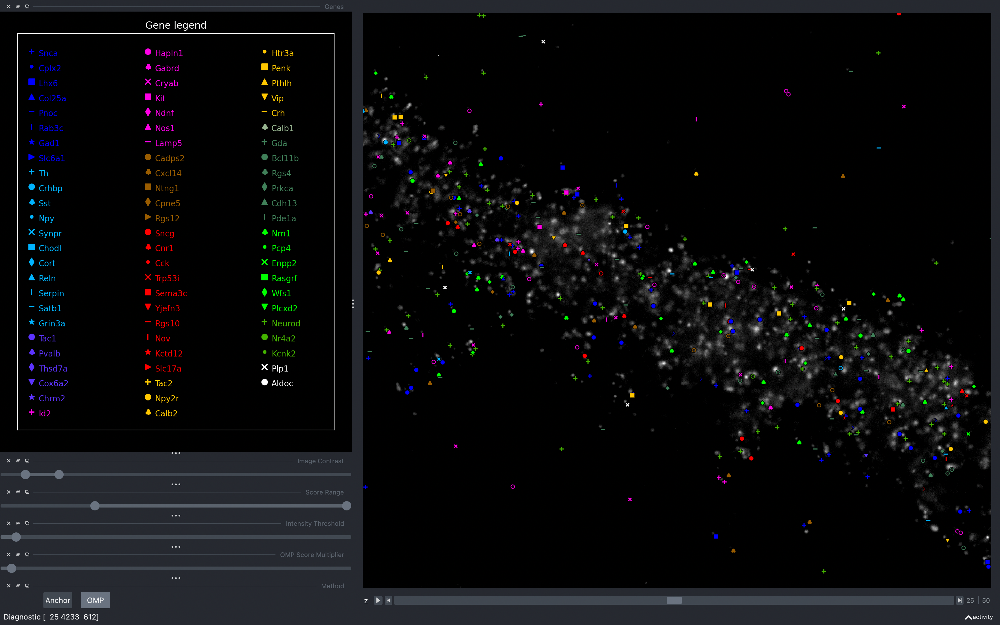

# Viewing the results

Once the pipeline has completed the [`reference_spots`](code/pipeline/run.md#iss.pipeline.run.run_reference_spots) step 
such that the notebook contains the [*call_spots*](notebook_comments.md#call_spots) and 
[*ref_spots*](notebook_comments.md#ref_spots) pages, the gene assignments of the spots found can be visualised
by using [`iss_plot`](code/plot/viewer.md).

This can be opened via the command line or using a python script. It requires either the path to the config file
(*/Users/user/iss/experiment/settings.ini*) or the path to the notebook file 
(*/Users/user/iss/experiment/notebook.npz*):

=== "Command Line"

    ``` bash
    python -m iss /Users/user/iss/experiment/settings.ini -view
    ```

=== "Python Script Using Config Path"
    ``` python
    from iss import iss_plot, Notebook
    ini_file = '/Users/user/iss/experiment/settings.ini'
    nb = Notebook(config_file=ini_file)
    iss_plot(nb)
    ```

=== "Python Script Using Notebook Path"
    ``` python
    from iss import iss_plot, Notebook
    nb_file = '/Users/user/iss/experiment/notebook.npz'
    nb = Notebook(nb_file)
    iss_plot(nb)
    ```

This will then open the napari viewer which will show the spots with a marker indicating which gene they 
were assigned to. If the notebook contains the [*omp*](notebook_comments.md#omp) page, the spots plotted
will be those found with the [omp algorithm](code/pipeline/omp.md), otherwise it will show the 
reference spots (those found on `nb.basic_info.ref_round`/`nb.basic_info.ref_channel`) 
and their gene assignments found using [call_reference_spots](code/pipeline/call_reference_spots.md). 
An example is shown below:

{width="800"}

## Background Image
By default, the spots will be plotted on top of the stitched DAPI image (`config['file_names']['big_dapi_image']`) 
if it exists, otherwise there will not be a background image.

To use a particular background image, when calling `iss_plot` a second argument needs to be given 
(`iss_plot(nb, background_image)`. There are several options:

- `'dapi'`: Will use `config['file_names']['big_dapi_image']` if it exists, otherwise will be no background (default).
- `'anchor'`: Will use `config['file_names']['big_anchor_image']` if it exists, otherwise will be no background.
- Path to .npy or .npz file: An example would be `'/Users/user/iss/experiment/background_image.npz'`. 
    This file must contain an image with axis in the order z-y-x (y-x if 2D).
- Numpy array: Can explicitly given the `[n_z x n_y x n_x]` (`[n_y x n_x]` in 2D) image desired.

## Sidebar

The sidebar on the left of the viewer includes various widgets which can change which spots are plotted.

### Select Genes
- To remove a gene from the plot, click on it in the gene legend. 
- To add a gene that has been removed, click on it again.
- To view only one gene, right-click on it.
- To go back to viewing all genes, right-click on a gene which is the only gene selected.

### Image contrast
The image contrast slider controls the brightness of the background image.

### Method
If the notebook contains the *omp* page, a pair of buttons labelled *OMP* and *Anchor* will appear at the bottom of the 
sidebar. Initially the *OMP* button is selected meaning the spots shown are those saved in the 
[*omp*](notebook_comments.md#omp) page. 
Pressing the *Anchor* button will change the spots shown to be those saved in the 
[*ref_spots*](notebook_comments.md#ref_spots) page.

If the notebook does not have the *omp* page, these buttons will not be present and the spots shown will be those 
saved in the [*ref_spots*](notebook_comments.md#ref_spots) page.


### Score Range
Only spots which pass a
[quality thresholding](code/call_spots/qual_check.md#iss.call_spots.qual_check.quality_threshold) 
are shown in the viewer.

Spots are assigned a `score` between 0 and 1 which indicates the likelihood that the gene assignment is legitimate. 
When the viewer is first opened, only spots with `score > config['thresholds']['score_omp]` 
(`score > config['thresholds']['score_ref]` if no *omp* page in notebook) are shown
and lower value of the score slider is set to `config['thresholds']['score_omp]`.

The slider can then be used to view only spots which satisfy:

`slider_low_value < score < slider_high_value`

!!! note "Effect of changing Method on Score Range slider"
    
    The `score` computed for spots using the omp method **[ADD LINK TO DESCRION OF SCORE]** differs from that used 
    with the ref_spots method **[ADD LINK TO DESCRION OF SCORE]**.
    Thus, we keep a unique score range slider for each method so that when the method is changed using the buttons, 
    the score range slider values will also change to the last values used with that method.

### Intensity Threshold
As well as a score, each spot has an [`intensity`](code/call_spots/qual_check.md#iss.call_spots.get_spot_intensity) 
value.

The [quality thresholding](code/call_spots/qual_check.md#iss.call_spots.qual_check.quality_threshold) also means 
that only spots with `intensity > intensity_thresh` are shown in the viewer.

Initially, `intensity_thresh` will be set to `config['thresholds']['intensity]` and the slider can be used to change it.

!!! note "Effect of changing Method on Intensity Threshold slider"
    
    The `intensity` is computed in the same way for omp method spots and ref_spots method spots.
    Thus the value of `intensity_thresh` will not change when the method is changed using the buttons.


## Diagnostics

